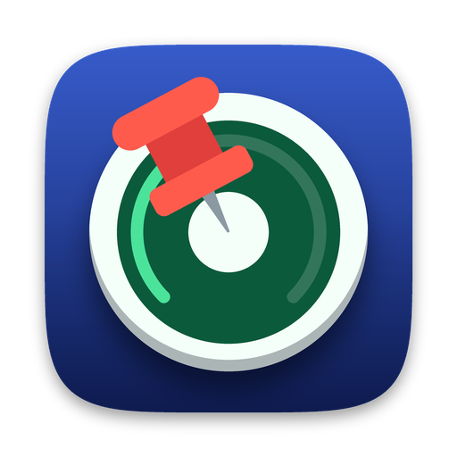
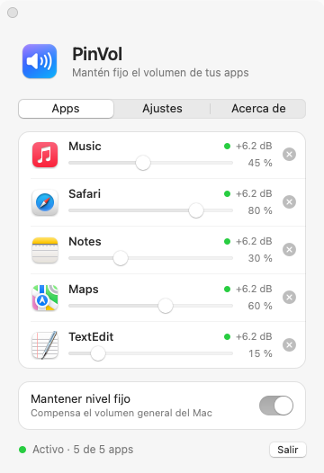
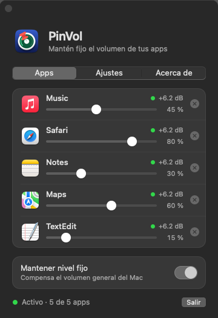

<p align="center">
  
</p>

<h1 align="center">PinVol</h1>

<p align="center">
  <b>Fixed volume for your Mac apps.</b><br>
  Pin up to 5 apps at their own level, whatever the system volume.
</p>

<p align="center">
  <b>English</b> | <a href="README.es.md">Español</a>
</p>

<p align="center">
  <a href="https://github.com/claudiouvm/PinVol/stargazers"></a>
  <a href="https://github.com/claudiouvm/PinVol/releases/latest"></a>
  <a href="https://github.com/claudiouvm/PinVol/releases"></a>
  
  
  
  
  <a href="LICENSE"></a>
  <a href="https://github.com/claudiouvm/PinVol/pulls"></a>
  <a href="https://www.paypal.com/donate/?business=8Z649D8XXB46J&amp;no_recurring=0&amp;item_name=If+you+would+like+to+buy+me+a+coffee%2C+I+will+be+more+than+happy.+Really%2C+I+drink+a+lot+of+coffee%21&amp;currency_code=USD"></a>
</p>

<p align="center">
  
  
</p>

<p align="center">
  <a href="https://github.com/claudiouvm/PinVol/releases/latest/download/PinVol.dmg"><b>⬇️ Download PinVol.dmg</b></a>
</p>

* * *

## Why PinVol?

- 🔒 **It stays put.** Lower the system volume to enjoy music or a video; the apps you pinned keep exactly the level you chose.
- 🎛️ **Up to 5 apps**, each with its own slider. Drop the `.app` in and you're done.
- 🪶 **Tiny and native.** Built for Apple Silicon with AppKit and Core Audio only: no dependencies, no drivers, about 15–20 MB of memory.
- 🕊️ **No telemetry.** The only network request is an optional once-a-day check for a new release on GitHub.

## Features

| Feature | What it does |
|---|---|
| **Fixed level per app** | Each pinned app keeps its own level, on the same scale as the system volume. |
| **Drag and drop** | Drop one or several `.app` files; the window grows and shrinks with them. |
| **Menu bar and Dock** | Open it from either one. Set to open at login, it goes straight to the menu bar, without the window, once you have apps pinned. |
| **Light and dark** | Native controls that follow your appearance. |
| **English and Spanish** | The interface follows your Mac's language: Spanish if your Mac is set to Spanish, English otherwise. |
| **Updates** | Tells you when a new version is out and, when you ask, downloads and installs it. You can check any time from the menu bar icon. It never installs anything by itself. |

## Install

1. [Download `PinVol.dmg`](https://github.com/claudiouvm/PinVol/releases/latest/download/PinVol.dmg) and drag PinVol to **Applications**.
2. Open it and drag the app you want to pin onto the dotted area.
3. Allow **System Audio Recording** when macOS asks.

**Requires a Mac with Apple Silicon (M1 or later) and macOS 26 Tahoe or later.** On macOS 14.2–15 use [version 1.2](https://github.com/claudiouvm/PinVol/releases/tag/v1.2); on an Intel Mac, [version 1.1](https://github.com/claudiouvm/PinVol/releases/tag/v1.1), the last universal build. Keep PinVol in `/Applications`: on macOS 27 the menu bar icon only shows from there.

PinVol is ad-hoc signed and not notarized. If macOS says it is "damaged", run:

```sh
xattr -dr com.apple.quarantine /Applications/PinVol.app
```

**Build from source:** `./build.sh install` on a Mac with Apple Silicon (needs the Xcode 26 command line tools).

## How it works

macOS has no per-app volume. PinVol taps the audio of each pinned app, mutes the original and plays it back through your output device with a gain of *pinned level ÷ system volume*, recomputed whenever the system volume changes. More in [docs/DEVELOPMENT.md](docs/DEVELOPMENT.md).

## License

[MIT](LICENSE) © Claudiouvm

* * *

Made in Chile by Claudiouvm and Claude <3 · If PinVol is useful to you, a ⭐ helps.
