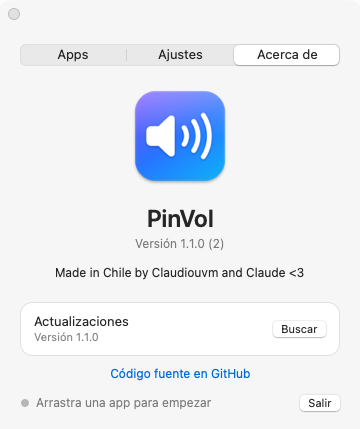

# PinVol

App nativa de macOS que mantiene **fijo el volumen de una app**, sin importar cuánto subas o bajes el volumen del sistema.

Nació para un caso concreto: una app que simula el sonido de un teclado mecánico al teclear y que no debía bajar de volumen cuando se baja el volumen general del Mac (para escuchar música o ver un video más bajo).

<p align="center">
  
  
  
</p>

## Uso

1. Abre PinVol y **arrastra el `.app`** que quieres controlar a la zona punteada. Puedes añadir **hasta 5 apps**; también sirve soltar varias a la vez.
2. Ajusta el **nivel fijo** de cada app con su slider (usa la misma escala que el volumen del sistema).
3. Listo: el volumen de esas apps queda igual aunque cambies el volumen general. El resto de las apps (música, videos) se comportan con normalidad.

Cada app muestra su estado, por ejemplo `+6.2 dB` (la ganancia que se está aplicando); el pie de la ventana resume el estado general. El interruptor **Mantener nivel fijo** activa o desactiva todas a la vez.

Para dejar de controlar una app: botón **✕** de su fila, o **clic derecho → Quitar app**.

La ventana tiene tres pestañas:

- **Apps**: la zona de arrastre y la lista. La zona se adapta: grande cuando no hay apps, una franja compacta cuando ya hay alguna y desaparece al llegar a 5. La ventana crece o se encoge con cada app (unos 58 pt por fila), así que nunca pasa de cinco filas.
- **Ajustes**: Dock, barra de menús, inicio de sesión y búsqueda automática de actualizaciones.
- **Acerca de**: logo, versión, créditos y búsqueda manual de actualizaciones.

Se puede abrir desde el **Dock** (clic abre la ventana; clic derecho muestra el estado y permite activar o desactivar el nivel fijo) y desde la **barra de menús**. Ambos accesos se pueden apagar en Ajustes, pero siempre queda al menos uno.

## Instalación

### Desde el .dmg

Descarga [`dist/PinVol.dmg`](dist/PinVol.dmg) (o el de la última [release](https://github.com/claudiouvm/PinVol/releases/latest)), ábrelo y arrastra PinVol a Aplicaciones. Es un binario universal (Apple Silicon e Intel). Un GitHub Action lo recompila y lo actualiza en el repo en cada cambio a `main`.

La app va firmada ad-hoc, no notarizada por Apple. Si macOS dice que está «dañada» o no la deja abrir:

```sh
xattr -dr com.apple.quarantine /Applications/PinVol.app
```

### Desde el código

Requiere macOS 14.2 o posterior (desarrollada y probada en macOS 27) y las herramientas de línea de comandos de Xcode (Swift). No usa dependencias externas.

```sh
./build.sh install
```

Compila, firma ad-hoc y copia la app a `/Applications`. Sin `install`, `./build.sh` solo genera `build/PinVol.app`.

La primera vez que PinVol captura el audio de una app, macOS pide el permiso **Grabación de audio del sistema**.

> **Instálala en `/Applications`.** En macOS 27, el ícono de la barra de menús solo aparece si la app está en `/Applications`. En las pruebas, la misma app con firma de desarrollador válida, ejecutada desde otra carpeta, no era identificada por la barra de menús y su ícono nunca se mostraba. No depende de la firma: PinVol va firmada ad-hoc y funciona desde `/Applications`.

## Actualizaciones

PinVol consulta una vez al día (y cuando lo pides en **Acerca de**) la última release de GitHub y la compara con su versión. Si hay una nueva, muestra un aviso en la ventana y una entrada en el menú que abre la página de la release; no descarga ni instala nada por su cuenta. Se puede apagar en **Ajustes**.

Para publicar una versión: sube `CFBundleShortVersionString` (y `CFBundleVersion`) en `Info.plist` y haz merge a `main`. El workflow `Release` crea la release `v<versión>` con el `.dmg` adjunto si todavía no existe.

> La consulta usa la API pública de GitHub: solo funciona si el repositorio es **público**. Con el repositorio privado la app indica «No hay versiones publicadas (o el repositorio es privado)».

## Cómo funciona

macOS no tiene volumen por app. PinVol usa las **Core Audio process taps** (`AudioHardwareCreateProcessTap`, macOS 14.2+):

1. Crea un tap sobre los procesos de la app (incluidos sus procesos auxiliares: coincide por prefijo del bundle id, algo necesario en navegadores y apps Electron). El audio original queda silenciado. Cada app fijada tiene su propio tap y su propio nivel; si dos apps comparten prefijo (`com.google.Chrome` y `com.google.Chrome.canary`), los procesos van a la más específica.
2. Reproduce ese audio por un dispositivo agregado privado, aplicando una ganancia.
3. La ganancia es `nivel fijo ÷ volumen del sistema`, recalculada cada vez que cambia el volumen o el mute, con un limitador suave y un máximo de +24 dB.

El detalle importante está en cómo se miden los decibeles. La conversión estándar escalar→dB que expone Core Audio **no coincide con la curva real** que aplica el sistema (en los Mac con altavoces integrados es cuadrática: `dB = −63.5 × (1 − √volumen)`). Usarla hace que la app suba o baje al mover el volumen. PinVol lee los dB reales del dispositivo (`kAudioDevicePropertyVolumeDecibels`) e invierte la conversión dB→escalar del propio dispositivo para traducir el nivel del slider.

## Arquitectura

PinVol corre como **dos instancias de la misma app**:

- **Residente**: Dock y barra de menús, motor de audio y ajustes guardados. Siempre viva.
- **Interfaz** (`--ui`): muestra la ventana y termina al cerrarla.

Se comunican con `DistributedNotificationCenter`. La razón es la memoria: abrir una ventana hace que AppKit reserve unos 8 MB para dibujarla, más 5–7 MB por los interruptores y el slider nativos, y el sistema no los devuelve aunque cierres la ventana. Con la ventana en otro proceso, esa memoria se libera al cerrarla. Con la ventana cerrada, el proceso residente ocupa unos 15–20 MB; mientras está abierta, la instancia de interfaz suma unos 22–25 MB más.

Todos los controles son nativos de AppKit (`NSSwitch`, `NSSlider`, símbolos SF) y respetan el modo claro y oscuro.

El código está repartido por responsabilidad en `Sources/PinVol/`:

| Archivo | Contenido |
|---|---|
| `main.swift` | Instancia residente (Dock, barra de menús) y arranque |
| `UIDelegate.swift` | Instancia de interfaz (`--ui`) y menú principal |
| `Controller.swift` | Estado guardado, un `Engine` por app, mensajes de la interfaz y comprobación de versión |
| `Audio.swift` | Core Audio: tap, dispositivo agregado, ganancia, volumen del sistema |
| `Model.swift` | `AppState`, `PinnedApp`, mensajería entre procesos |
| `SettingsWindow.swift` | Ventana con pestañas (Apps, Ajustes, Acerca de) |
| `AppsPanel.swift` | Zona de arrastre y filas de apps |
| `Style.swift` | Etiquetas, tarjetas y filas de ajustes compartidas |
| `Updates.swift` | Consulta de la última release en GitHub |
| `Snapshot.swift` | Solo desarrollo: capturas de la ventana |

## Desarrollo

| Comando | Qué hace |
|---|---|
| `./build.sh` | Compila y genera `build/PinVol.app` |
| `./build.sh install` | Además la instala en `/Applications` y la abre |
| `tools/make-dmg.sh` | Compila un binario universal y genera `dist/PinVol.dmg` |
| `./snapshot.sh` | Compila una variante de desarrollo y genera capturas PNG de la ventana (claro/oscuro, 1 y 5 apps, cada pestaña) en `build/snapshots/`, sin necesitar permiso de grabación de pantalla |
| `tools/make-icon.sh` | Regenera `Resources/AppIcon.icns` |

`snapshot.sh` compila con `-DSNAPSHOT` y usa otro identificador (`com.claudiouvm.pinvol.dev`), así que no toca los ajustes ni los permisos de la app real.

## Límites conocidos

- El máximo es de 5 apps a la vez (`maxPinnedApps` en `Model.swift`): cada una abre su propio tap y su propio dispositivo agregado.
- Con el volumen del sistema muy bajo y un nivel fijo alto, la ganancia llega al máximo (+24 dB) y ya no se puede compensar más; la línea de estado lo indica.
- En salidas sin control de volumen por software (algunas HDMI o USB) no hay nada que compensar y la app lo avisa.
- Las apps con DRM o procesos protegidos pueden no ser capturables.
- El `.dmg` no está notarizado (haría falta una cuenta de desarrollador de Apple); ver la instalación.
- Al estar firmada ad-hoc, cada recompilación cambia la firma y macOS puede volver a pedir el permiso de audio.
