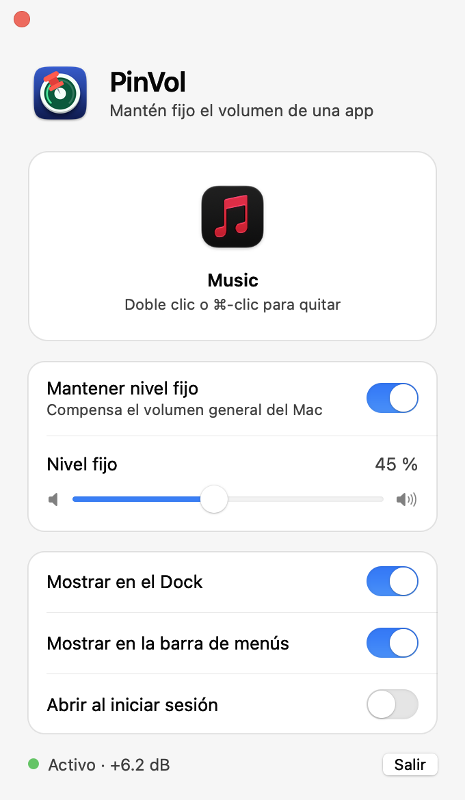
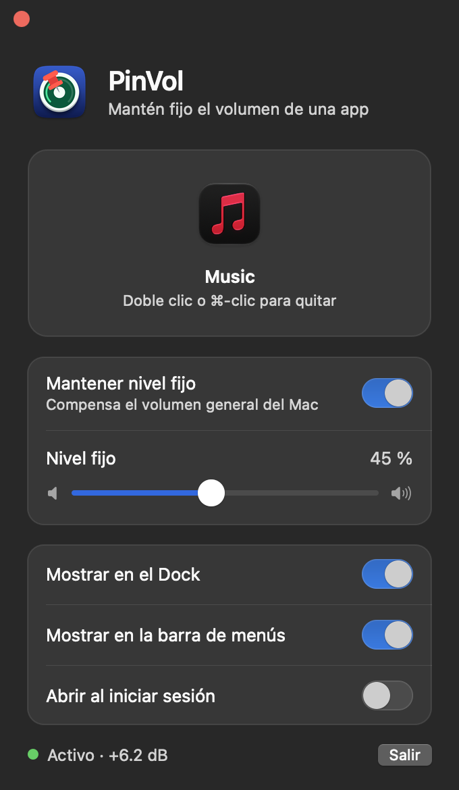

# PinVol

App nativa de macOS que mantiene **fijo el volumen de una app**, sin importar cuánto subas o bajes el volumen del sistema.

Nació para un caso concreto: una app que simula el sonido de un teclado mecánico al teclear y que no debía bajar de volumen cuando se baja el volumen general del Mac (para escuchar música o ver un video más bajo).

<p align="center">
  
  
</p>

## Uso

1. Abre PinVol y **arrastra el `.app`** que quieres controlar a la zona punteada.
2. Ajusta el **nivel fijo** con el slider (usa la misma escala que el volumen del sistema).
3. Listo: el volumen de esa app queda igual aunque cambies el volumen general. El resto de las apps (música, videos) se comportan con normalidad.

La línea de estado muestra la ganancia que se está aplicando, por ejemplo `Activo · +6.2 dB`.

Para dejar de controlar una app: **doble clic**, **⌘-clic** o **clic derecho → Quitar app** sobre su ícono.

Se puede abrir desde el **Dock** (clic abre la ventana; clic derecho muestra el estado y permite activar o desactivar el nivel fijo) y desde la **barra de menús**. Ambos accesos se pueden apagar en la ventana, pero siempre queda al menos uno.

## Instalación

Requiere macOS 14.2 o posterior (desarrollada y probada en macOS 27) y las herramientas de línea de comandos de Xcode (Swift). No usa dependencias externas.

```sh
./build.sh install
```

Compila, firma ad-hoc y copia la app a `/Applications`, y refresca el registro de Launch Services para que el Dock y Ajustes del Sistema muestren el ícono actual. Sin `install`, `./build.sh` solo genera `build/PinVol.app`.

La primera vez que PinVol captura el audio de una app, macOS pide el permiso **Grabación de audio del sistema**.

> **Instálala en `/Applications`.** En macOS 27, el ícono de la barra de menús solo aparece si la app está en `/Applications`. En las pruebas, la misma app con firma de desarrollador válida, ejecutada desde otra carpeta, no era identificada por la barra de menús y su ícono nunca se mostraba. No depende de la firma: PinVol va firmada ad-hoc y funciona desde `/Applications`.

## Cómo funciona

macOS no tiene volumen por app. PinVol usa las **Core Audio process taps** (`AudioHardwareCreateProcessTap`, macOS 14.2+):

1. Crea un tap sobre los procesos de la app (incluidos sus procesos auxiliares: coincide por prefijo del bundle id, algo necesario en navegadores y apps Electron). El audio original queda silenciado.
2. Reproduce ese audio por un dispositivo agregado privado, aplicando una ganancia.
3. La ganancia es `nivel fijo ÷ volumen del sistema`, recalculada cada vez que cambia el volumen o el mute, con un limitador suave y un máximo de +24 dB.

El detalle importante está en cómo se miden los decibeles. La conversión estándar escalar→dB que expone Core Audio **no coincide con la curva real** que aplica el sistema (en los Mac con altavoces integrados es cuadrática: `dB = −63.5 × (1 − √volumen)`). Usarla hace que la app suba o baje al mover el volumen. PinVol lee los dB reales del dispositivo (`kAudioDevicePropertyVolumeDecibels`) e invierte la conversión dB→escalar del propio dispositivo para traducir el nivel del slider.

## Arquitectura

PinVol corre como **dos instancias de la misma app**:

- **Residente**: Dock y barra de menús, motor de audio y ajustes guardados. Siempre viva.
- **Interfaz** (`--ui`): muestra la ventana y termina al cerrarla.

Se comunican con `DistributedNotificationCenter`. La razón es la memoria: abrir una ventana hace que AppKit reserve unos 8 MB para dibujarla, más 5–7 MB por los interruptores y el slider nativos, y el sistema no los devuelve aunque cierres la ventana. Con la ventana en otro proceso, esa memoria se libera al cerrarla. Con la ventana cerrada, el proceso residente ocupa unos 15–20 MB; mientras está abierta, la instancia de interfaz suma unos 22–25 MB más.

Todos los controles son nativos de AppKit (`NSSwitch`, `NSSlider`, símbolos SF) y respetan el modo claro y oscuro.

## Desarrollo

| Comando | Qué hace |
|---|---|
| `./build.sh` | Compila y genera `build/PinVol.app` |
| `./build.sh install` | Además la instala en `/Applications` y la abre |
| `./snapshot.sh` | Compila una variante de desarrollo y genera capturas PNG de la ventana (claro/oscuro) en `build/snapshots/`, sin necesitar permiso de grabación de pantalla |
| `python3 tools/make-icon.py` | Regenera `Resources/AppIcon.icns` (el ícono está dibujado en código; requiere `pip3 install pillow`) |

`snapshot.sh` compila con `-DSNAPSHOT` y usa otro identificador (`com.claudiouvm.pinvol.dev`), así que no toca los ajustes ni los permisos de la app real.

## Límites conocidos

- Con el volumen del sistema muy bajo y un nivel fijo alto, la ganancia llega al máximo (+24 dB) y ya no se puede compensar más; la línea de estado lo indica.
- En salidas sin control de volumen por software (algunas HDMI o USB) no hay nada que compensar y la app lo avisa.
- Las apps con DRM o procesos protegidos pueden no ser capturables.
- Al estar firmada ad-hoc, cada recompilación cambia la firma y macOS puede volver a pedir el permiso de audio.
